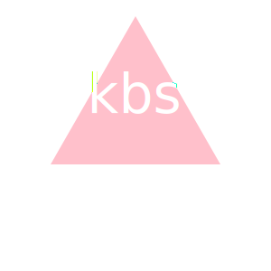

# SVG Logo Maker

## Description

A Node.js command-line application that takes in user input to generate a logo and save it as an [SVG file](https://en.wikipedia.org/wiki/Scalable_Vector_Graphics). The application prompts the user to select a shape `(Triangle, Square, or Circle)`, color, text color, and provide text for the logo, and save the generated SVG to a `.svg` file.

#### Requirements
The application uses [Jest](https://www.npmjs.com/package/jest) for running the unit tests and [Inquirer](https://www.npmjs.com/package/inquirer/v/8.2.4) for collecting input from the user. The application will be invoked by using the following command:

```bash
node index.js
```

## Video Link

[App Walkthrough](https://github.com/kalynsifuentez/svg-logo-maker.git)


## Code Source
[HTTPS GitHub Repositry: SVG Logo Maker](https://github.com/kalynsifuentez/svg-logo-maker.git)

## Examples
### Square

 

### Triangle

 

### Circle

 


## Screenshot
[Example SVG](https://static.fullstack-bootcamp.com/fullstack-ground/module-10/circle.svg)

## Acknowledgements

* Central Tutor Support: Jose Lopez
* Peer collaboration: Martin Harvey
* [Example SVG](https://static.fullstack-bootcamp.com/fullstack-ground/module-10/circle.svg)

* [Scalable Vector Graphics (SVG)](https://en.wikipedia.org/wiki/Scalable_Vector_Graphics)

* [SVG tutorial](https://developer.mozilla.org/en-US/docs/Web/SVG/Tutorial)

* [Basic SVG shapes](https://developer.mozilla.org/en-US/docs/Web/SVG/Tutorial/Basic_Shapes)

* [Text in SVG](https://developer.mozilla.org/en-US/docs/Web/SVG/Tutorial/Texts)

* [SVG VS Code extension](https://marketplace.visualstudio.com/items?itemName=jock.svg)
